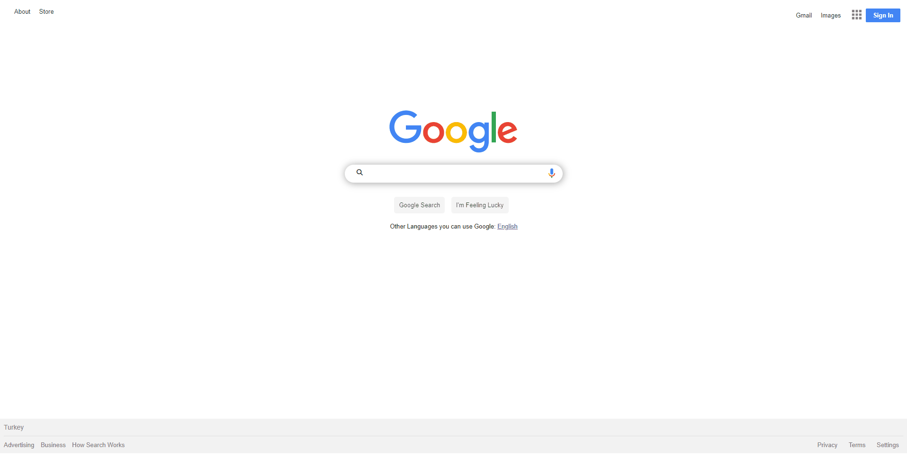

# GOOGLE LANDING PAGE (HTML+CSS)



## Description
This project was created as a Google landing page.

## Project Skeleton 

```
GOOGLE-LANDING-PAGE(folder)
|
|----README.md
|----Img (folder)
|----index.html
|----style.css
|----action.js


## What I used in this project?

- ## Html
- ## Css
  - ### Display
  - ### Hover

<left> ⌛ Happy Coding  💻🎶🍕🍀✍ </left>